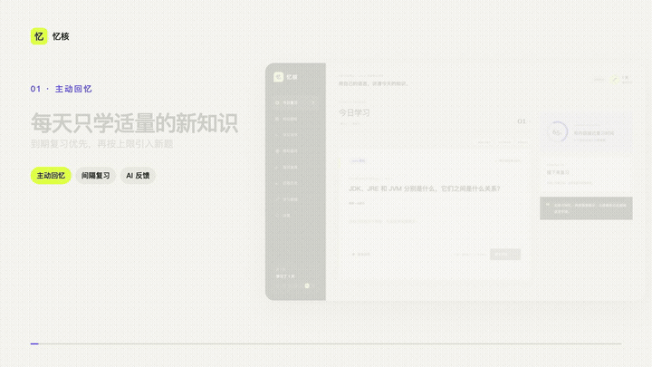

<div align="center">

# 忆核（Yihe Memory）

### 把“我好像会”，练成“我能在面试中讲清”

面向技术面试的 AI 主动回忆与间隔重复学习工具。用文字或语音回答开放题，获得针对概念覆盖、准确性和表达质量的反馈，再按个人记忆状态安排下一次复习。

[在线体验](https://yihe-memory.leo527952.chatgpt.site/) · [产品演示](media/demo-video/out/yihe-demo-landscape.mp4) · [学习机制](docs/LEARNING_METHOD.md) · [本地运行](#快速开始)

[](https://github.com/keii-2596/yihe-memory/actions/workflows/ci.yml)
[](LICENSE)


</div>

[](media/demo-video/out/yihe-demo-landscape.mp4)

点击预览观看完整的 [16:9 中文旁白演示](media/demo-video/out/yihe-demo-landscape.mp4)，也可以下载适合短视频平台的 [9:16 竖屏版本](media/demo-video/out/yihe-demo.mp4)。

## 为什么是忆核

- **主动回忆，而不是浏览答案**：先独立组织表达，忘记时再逐层查看提示和参考答案。
- **开放式回答也能获得反馈**：AI 或本地规则检查核心概念、准确性和表达结构，不要求死记标准措辞。
- **每一次回答都会影响复习计划**：根据个人复习记录、记忆稳定性和经过时间估算记住率；未学习内容不会获得虚假的预设分数。

## 快速开始

需要 Node.js 22 和 pnpm 10：

```bash
git clone https://github.com/keii-2596/yihe-memory.git
cd yihe-memory
pnpm install
cp .env.example .env.local
pnpm dev
```

打开 [http://localhost:3000](http://localhost:3000) 即可开始学习。AI 密钥是可选项；未配置时，题库、词书、间隔重复、导入导出和本地评分仍可使用。

提交改动前运行：

```bash
pnpm verify
```

## 核心能力

- **主动回忆与间隔重复**：分级提示、按需查看答案、每日新学/复习上限、到期复习优先、积压保护，以及 Anki 式撤销、隐藏、暂停和恢复。
- **AI 判题与表达训练**：文字或语音回答、概念覆盖检查、表达建议、面试官追问、本地评分回退和每日 AI 调用额度。
- **主题化题库与学习词书**：299 个主题、643 道内置技术面试卡片，覆盖 Java、前端、Go、Python、测试和 SRE；关联题自动错开，词书可按岗位、难度与公司方向选择或自定义。
- **FSRS 与面试倒计时**：使用标准 FSRS-6 安排个性化复习；设置面试日期后生成追赶期、每日任务、最终复习期和未来 30 天工作量预估。
- **从真实材料生成学习内容**：从 JD、Markdown、CSV、JSON、网页和 PDF 制卡，支持前端自定义判题、追问、制卡、转写和复盘 Prompt。
- **面试复盘**：上传面试录音或文字稿，由 AI 提炼薄弱点，生成复习题、行动计划和专属词书；原始录音不会长期保存。
- **学习数据与长期使用**：回答历史、同题对比、个人预计记住率、六周日历、学习周报、完成预测、提醒、离线缓存、备份迁移和 PWA。

## 学习流程

```text
选择词书 → 安排到期复习与少量新题 → 主动回答
        → AI / 本地反馈 → 自评掌握程度 → 计算下次复习时间
        → 面试复盘生成新题 → 进入下一轮训练
```

系统始终先安排已经到期的复习，再从当前词书引入新知识。预计记住率只使用当前用户的学习记录，不读取 MOOC 分数或其他用户的数据。详细规则见 [学习机制说明](docs/LEARNING_METHOD.md)。

## AI 与隐私

- 部署者可以配置兼容 OpenAI Chat Completions 的服务端接口；用户也可以在设置页填写自己的接口、Key 和模型。
- 个人 Key 只保存在当前标签页的 `sessionStorage`，不会进入云同步、学习备份或服务器日志，关闭标签页后自动清除。
- 服务端密钥不会通过查询接口返回；个人接口会经过 HTTPS、域名、端口和重定向限制，降低 SSRF 风险。
- 不配置任何 AI 服务时，应用仍会使用本地规则完成基础评估。

可用环境变量和默认值以 [`.env.example`](.env.example) 为准。身份信任边界与部署要求见 [认证接入文档](docs/AUTHENTICATION.md)。

## 文档

| 文档 | 内容 |
| --- | --- |
| [学习机制](docs/LEARNING_METHOD.md) | 每日任务、词书、记住率与间隔重复 |
| [题库说明](docs/QUESTION_BANK.md) | 题库结构、分类、难度与升级规则 |
| [认证接入](docs/AUTHENTICATION.md) | ChatGPT、GitHub、Google、企业网关与自托管 SSO |
| [留存与提醒](docs/RETENTION_AND_REMINDERS.md) | 浏览器、邮箱、企业微信群和日历提醒 |
| [Android 客户端](android/README.md) | Trusted Web Activity 构建与安装 |
| [贡献指南](CONTRIBUTING.md) | 本地开发、补题、纠错和提交变更 |
| [安全策略](SECURITY.md) | 私密报告安全问题 |

## 部署与数据

项目使用 Next.js/Vinext，可部署到 OpenAI Sites 或兼容 Cloudflare Workers 的环境。默认无需注册，学习数据保存在本机；绑定 D1 并接入可信身份后，可以开启账号隔离的跨设备同步。未绑定云存储时仍可作为完整的本地优先应用使用。

## 参与贡献

欢迎补充高质量面试知识点、修正文案和答案、完善学习算法，或改进可访问性与跨端体验。开始前请阅读 [贡献指南](CONTRIBUTING.md)。

## 许可证

[Business Source License 1.1](LICENSE) © 2026 keii-2596。允许学习、研究、修改、再分发和非生产使用；生产使用需要另行取得商业授权。当前版本最迟于 2030-08-30 自动转换为 GPL-2.0-or-later。
